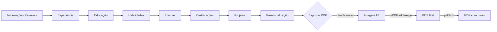
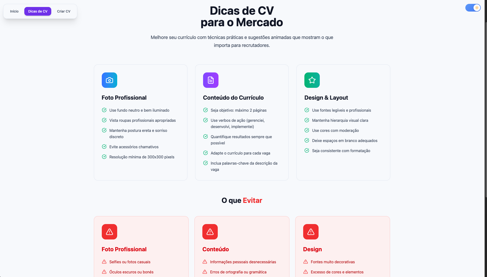
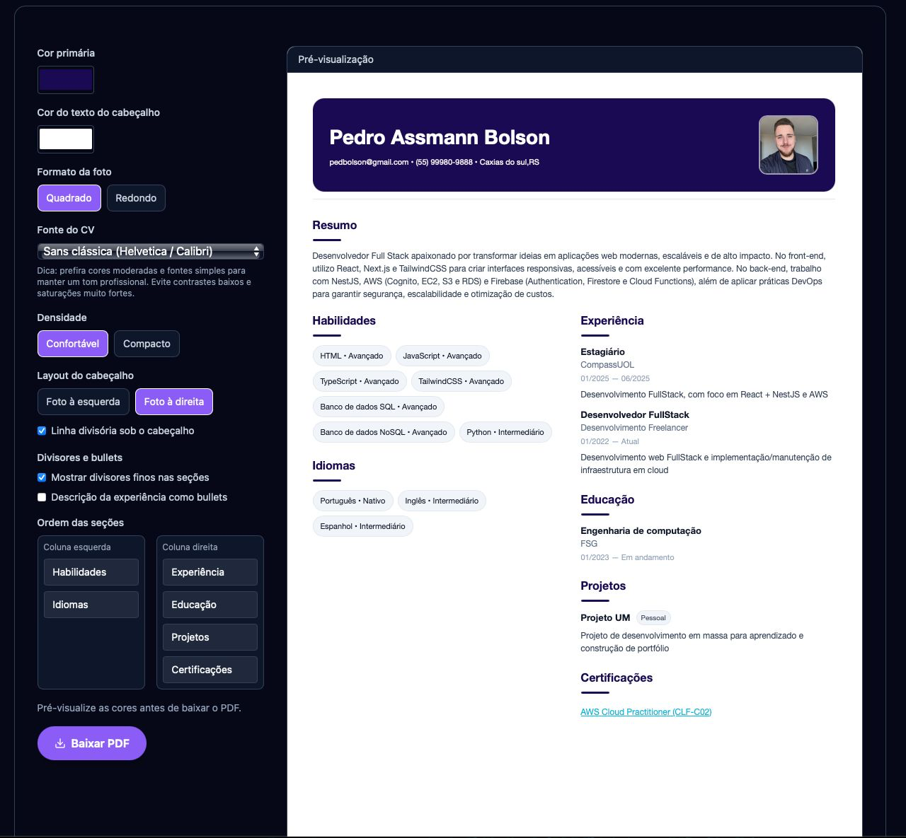

# Itinerário Extensionista 1 (GRUPO 04) — Conteúdo Acessível + Gerador de CV

Aplicação React com foco em conteúdo introdutório e um gerador de currículo com pré‑visualização fiel (WYSIWYG), personalização visual e exportação para PDF pronta para envio.

Principais objetivos
- Ajudar pessoas a aprender o básico de tecnologia e conteúdos atuais.
- Oferecer um fluxo simples para gerar um CV bem apresentado e consistente.

## Stack

| &nbsp; | &nbsp; |
|---|---|
|   | Base da aplicação (SPA) |
|  | Dev server e build |
|  | Estilo utilitário + variáveis de tema |
|  | Animações |
|  | Rotas (Início, Cursos, Dicas, Criar CV) |
|   | Datas mensais (MM/AAAA) em pt‑BR |
|  | Drag & drop nas seções |
|   | Exportação para PDF com fidelidade |

## Executar localmente

Pré‑requisitos: Node 18+ e PNPM/NPM/Yarn.

Instalação e dev server:

```
npm install
npm run dev
```

Build e preview do build:

```
npm run build
npm run preview
```

Scripts úteis (package.json):
- `dev`: inicia o Vite
- `build`: `tsc -b` + build do Vite
- `lint`: ESLint base
- `preview`: serve build gerado

## Estrutura de pastas

- `src/App.tsx` — Shell da aplicação, navegação fixa, rotas.
- `src/pages/` — Páginas de alto nível (`HomePage`, `CoursesPage`, `TutorialPage`, `FormPage`, `DashboardPage`).
- `src/components/` — Componentes reutilizáveis: `Hero`, `ResumeForm`, `ResumePreview`, `ThemeSwitch`, etc.
- `src/hooks/useTheme.ts` — Alternância Light/Dark usando class `dark` + localStorage.
- `src/index.css` — Variáveis CSS de tema e utilitários (cores, botões, bordas).
- `index.html` — Entrada do Vite.

## Rotas

- `/` — Início: destaque de conteúdo, CTA e cartões de categorias.
- `/cursos` — Mini Cursos: explore Tópicos → Conteúdos → Aulas com player do YouTube embutido e playlist ao lado.
- `/tutorial` — “Dicas de CV”: boas práticas de conteúdo/visual com animações.
- `/criar-cv` — Formulário em etapas para montar o currículo + pré‑visualização e exportação.

### Mini Cursos — UX resumida

- Fluxo por estágios com transições suaves (Framer Motion):
  - Tópicos: grid de cartões com busca. Ao selecionar, avança para Conteúdos.
  - Conteúdos: cartões do tópico escolhido + busca contextual e ação “Trocar tópico”.
  - Aulas: player grande (2/3 da tela) + playlist (1/3) com numeração e seleção; ações “Trocar conteúdo” e “Trocar tópico”.
- Tudo é carregado do Firestore via `src/lib/db.ts` (coleções `topics`, `contents`, `lessons`).
- Página: `src/pages/CoursesPage.tsx`.

### Gestão de conteúdos (Dashboard)

- Rota protegida: `/dashboard` (após login).
- Reordenar com drag‑and‑drop (tipos isolados por lista):
  - Tópicos, conteúdos e aulas possuem listas independentes com persistência do campo `order`.
- Edição rápida inline + adicionar/remover.
- Layout de três painéis fluido para organizar Tópicos → Conteúdos → Aulas em uma única tela.
- Arquivos: `src/pages/DashboardPage.tsx` e `src/lib/db.ts` (helpers de CRUD e ordenação).

## Gerador de CV — Fluxo e detalhes

Como funciona (passo a passo)
1. Informações Pessoais
   - Nome, e‑mail, telefone (máscara BR automática), localização e resumo.
   - Upload de foto (corte “cover” para manter proporção) e escolha do formato da foto (quadrado com cantos suaves ou redondo).
2. Experiência
   - Empresa, cargo, descrição e datas com seletor mensal (MM/AAAA, locale pt‑BR). Campo “Trabalho atual”.
   - Validação de datas: não permite datas futuras (maxDate).
3. Educação
   - Instituição, curso, área e datas (MM/AAAA), com opção “Em andamento”.
4. Habilidades
   - Lista de habilidades com nível (Iniciante/Intermediário/Avançado). Sem “links/certificados” aqui — isso fica em Certificações.
5. Idiomas
   - Idioma + nível (Básico/Intermediário/Avançado/Fluente/Nativo) e campos opcionais de certificação/observações.
6. Certificações
   - Título e link (clicável no PDF exportado).
7. Projetos
   - Título, tipo (Pessoal/Social/Outro), descrição e link.
8. Pré‑visualização e Exportação
   - Ajustes visuais:
     - Cor primária + cor do texto do cabeçalho.
     - Fonte (Inter/IBM Plex Sans; Helvetica/Calibri; IBM Plex Serif/Source Serif — serif conservadora).
     - Densidade (Confortável/Compacto).
     - Layout do cabeçalho (foto à esquerda/direita) + opcional “linha divisória”.
     - Divisores finos nas seções (on/off) e descrição de experiência em bullets (on/off).
     - Reordenar seções por coluna (arrasta‑e‑solta). Ambas as colunas aceitam qualquer seção.
   - Preview em duas colunas, responsivo, mantendo proporção A4 (794×1123 px lógicos) no contêiner de impressão.

Exportação para PDF
- Método padrão: html2canvas + jsPDF.addImage (WYSIWYG, fidelidade do layout).
- Links clicáveis: após gerar a imagem, são adicionadas anotações de link (pdf.link) por cima, usando as posições reais dos anchors — os links funcionam no PDF sem alterar o layout.
- Observação: a exportação atual gera uma única página A4; conteúdo além da primeira página é cortado. Para relatórios longos, avaliar exportação paginada em uma próxima evolução.

Fluxo visual (mermaid)



Personalização — boas práticas
- Cores: prefira tons moderados para manter a leitura profissional (evite saturação alta e baixo contraste).
- Fontes: use “Moderna” ou “Sans clássica” para áreas técnicas; “Serif profissional” mantém leitura formal sem aparência cursiva exagerada.
- Foto: use um recorte com boa iluminação e fundo discreto; no formato quadrado os cantos são suavizados para acabamento mais elegante.

Arquivos relevantes
- `src/components/ResumeForm.tsx`
  - Estados do formulário, etapas, DatePickers (pt‑BR + MM/AAAA + maxDate), máscara de telefone, painel de customização e exportação em PDF com links clicáveis.
  - Drag & drop com `@hello-pangea/dnd` para reordenar seções entre as duas colunas.
- `src/components/ResumePreview.tsx`
  - Layout do CV, header, foto, duas colunas, títulos/cores, chips inline (habilidades/idiomas) e links destacados.
- `src/pages/CoursesPage.tsx`
  - Explorer por estágios (Tópicos → Conteúdos → Aulas) com player YouTube + playlist; busca contextual e transições.
- `src/pages/DashboardPage.tsx`
  - Gerenciador para criar, editar e reordenar tópicos, conteúdos e aulas (drag‑and‑drop com persistência de `order`).
- `src/lib/db.ts`
  - CRUD no Firestore e helpers de reordenação (`reorderTopics/Contents/Lessons`).

## Variáveis de ambiente (Vite + Firebase)

Configure um `.env.local` com as chaves do Firebase (Vite expõe apenas prefixo `VITE_`):

```
VITE_FIREBASE_API_KEY=...
VITE_FIREBASE_AUTH_DOMAIN=...
VITE_FIREBASE_PROJECT_ID=...
VITE_FIREBASE_STORAGE_BUCKET=...
VITE_FIREBASE_MESSAGING_SENDER_ID=...
VITE_FIREBASE_APP_ID=...
VITE_FIREBASE_MEASUREMENT_ID=...
```

O módulo `src/lib/firebase.ts` lê essas variáveis via `import.meta.env`.

Capturas (ilustrativas)

| Tela | Imagem |
|---|---|
| Início |  |
| Dicas de CV |  |
| Criar CV (Pré‑visualização) |  |

## Tema e Acessibilidade

- Tema: variáveis em `src/index.css` definem cores base; `ThemeSwitch` alterna tema adicionando/removendo a classe `dark` no `html`.
- A11y: contraste de botões primários e foco visível; animações sutis via Framer Motion.

## Padrões de código

- TypeScript em todos os componentes.
- Estilo: utilitários do Tailwind e variáveis CSS (sem CSS inline complexo, exceto no preview PDF onde ajuda no WYSIWYG).
- Evitar comentários desnecessários; nomes claros para estados/props.

## Limitações atuais e próximos passos

- Exportação: uma página A4 (conteúdo extra é cortado). Próximo passo: exportação paginada preservando links clicáveis por página.
- Persistência local: salvar rascunho (localStorage) para retomar depois.
- Templates: variações (Clássico/Compacto/Sidebar), com o mesmo pipeline de exportação.
- Conteúdo: painel de coordenadores para “Dicas de CV” e materiais.
- Padronizar foto para CV: Padronizar tamanho criando modal para selecionar uma parte da foto que tenha as dimensões para evitar distorção

---

Qualquer dúvida sobre o fluxo do gerador ou tema, veja `ResumeForm.tsx` e `ResumePreview.tsx` — são os pontos de entrada mais diretos para evoluir a experiência do CV.

## Autenticação e Acesso

- Autenticação: Firebase Auth (Email/Senha).
- Contexto: `src/context/AuthContext.tsx` expõe `user`, `loading`, `signIn(email, senha)` e `signOutUser()`.
- Proteção de rotas: `src/routes/ProtectedRoute.tsx` redireciona para `/auth` quando não há sessão.
- Páginas:
  - `/auth` — Tela de login simples (email/senha). Não há fluxo de cadastro público.
  - `/dashboard` — Área protegida de gestão de conteúdos (Tópicos/Conteúdos/Aulas).
- Habilitar no Firebase:
  1. Ative “Email/Password” em Authentication > Sign-in method no Console Firebase.
  2. Crie usuários pela aba “Users” (ou via script/admin). O app não expõe cadastro.
- Logout: botão “Sair” no cabeçalho do Dashboard usa `signOutUser()`.
